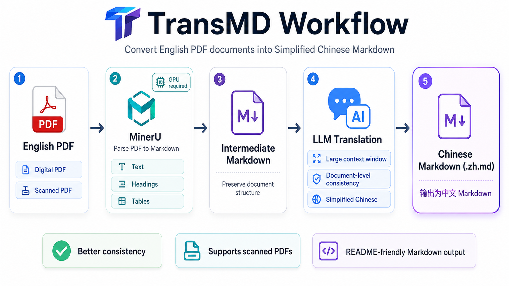

# TransMD

[简体中文](./README.zh.md) | English

## Introduction

**Convert any English PDF document into Chinese Markdown.**

TransMD supports both digitally generated PDFs and scanned PDFs. The conversion process preserves the structure of the source PDF, including text, headings, lists, and tables, and translates the content into Simplified Chinese. Because the translation stage uses a large context window from an LLM, TransMD usually delivers better document-level consistency and overall translation quality than typical short-context translation tools. The final output Markdown file ends with `.zh.md`, indicating that it is the Chinese version of the original Markdown.



## How It Works

TransMD first calls the official `mineru` CLI to convert a PDF into Markdown, including MinerU's scanned-document processing workflow. It then uses an LLM to translate the generated Markdown into Simplified Chinese with a larger document context, instead of translating it sentence by sentence in fragmented chunks.

## Requirements

- A GPU capable of running MinerU ([at least 8GB VRAM, recommended 16GB or more](https://github.com/opendatalab/MinerU/blob/master/docs/zh/quick_start/docker_deployment.md))

## Installation

1. Since TransMD depends on [mineru](https://github.com/opendatalab/mineru) to parse PDFs into Markdown, install MinerU first:

```bash
uv tool install "mineru[core,vllm]"
```

2. Install TransMD:

```bash
cargo install transmd
```

## Configuration

The configuration file is located at `~/.config/TransMD/config.toml`. The program creates it on the first run, or you can create it manually.

```toml
[llm]
base_url = "https://api.deepseek.com"
model = "deepseek-chat"
context_window = 64000
max_output_tokens = 8000
max_chunk_tokens = 5000
```

The Xiaomi `mimo-flash` model is recommended for a good balance of translation quality and speed.

## Usage

Because TransMD relies on an OpenAI-compatible API for translation, you need to set the `OPENAI_API_KEY` environment variable to your API key:

```bash
export OPENAI_API_KEY="your-api-key"
```

```bash
transmd /path/to/input.pdf /path/to/output-dir
```

> [!WARNING]
> On the first launch, MinerU may need to download some model files, so startup can be slow.

## Progress

- [x] Basic translation support
- [ ] Service and Docker deployment: package TransMD as a RESTful API service and provide a Docker image for easier deployment and usage
- [ ] Long-document translation: build an Agent-based workflow to support very long documents, including 300+ pages
- [ ] Evaluation and optimization of translation performance across different models
- [ ] Support for more target languages, such as Japanese and Korean
- [ ] More translation options, such as formal/informal tone and terminology handling

## Disclaimer

TransMD is designed to provide a convenient PDF-to-Markdown translation workflow, but translation quality can be affected by model capability, document complexity, and context window limits. For important or sensitive documents, it is recommended that you manually review and polish the output after the initial translation to ensure accuracy and readability. TransMD is not responsible for any loss or misunderstanding caused by translation errors.
